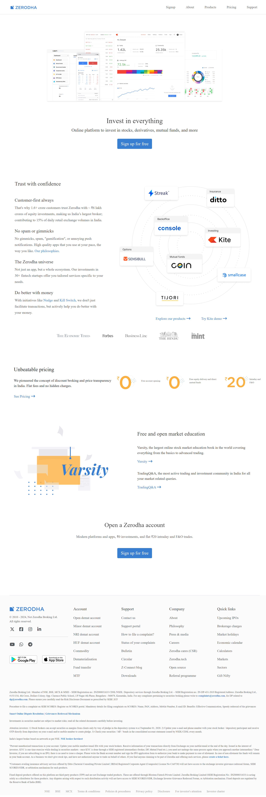
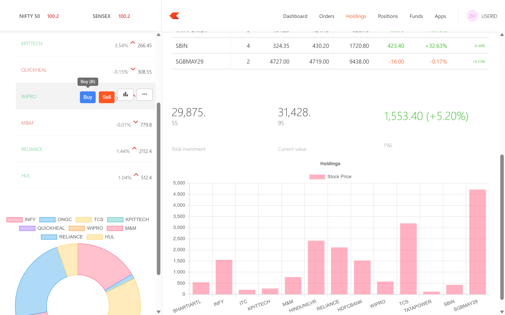
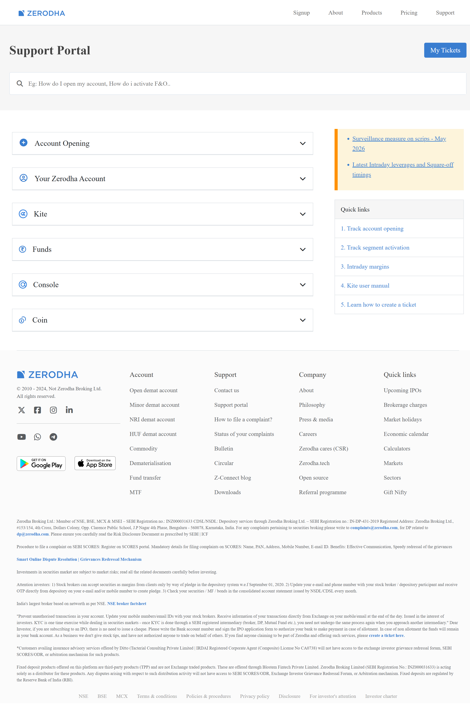

# 📈 Zerodha Clone Project

A frontend and dashboard clone project inspired by the Zerodha website.  
This project was built for learning purposes using React, Node.js, Express, and MongoDB.

---

# ✨ Features

## 🌐 Frontend Pages
The following main pages/components of the Zerodha website were recreated:

- 🏠 Home Page
- 📝 Signup Page
- ℹ️ About Page
- 📦 Product Page
- 🛠️ Support Page
- 🧭 Navbar
- 📄 Footer
- ❌ 404 Page Not Found

---

## 📊 Dashboard
A stock dashboard UI was also developed using React.

### Dashboard Includes
- 💼 Holdings section
- 📌 Positions section
- 📑 Orders section
- 📈 Stock graphs/charts
- 📱 Responsive dashboard components

> ⚠️ Note:  
> Due to limited knowledge of stocks, trading, and the stock market, the dashboard is not fully functional and is mainly focused on frontend structure and backend connectivity.

---

# 🛠️ Tech Stack

## 🎨 Frontend
- React.js
- Bootstrap
- CSS

## 📊 Dashboard
- React.js
- Chart.js / Recharts

## ⚙️ Backend
- Node.js
- Express.js

## 🗄️ Database
- MongoDB

---

# 🔗 Backend Functionality

The backend:
- 🔌 Connects to a MongoDB database
- 🧪 Stores dummy stock-related data
- 📤 Sends JSON responses to the frontend/dashboard
- 🧱 Uses models and schemas for database structure

---

# ⚠️ Important Note

This project is **not fully connected as a single application**.

The:
- 🌐 Frontend
- 📊 Dashboard
- ⚙️ Backend

must all be started separately.

---

# ⚠️ Responsive Design Note

This project is currently not fully responsive for different screen sizes and devices.  
The main focus of this project was frontend structure, backend integration, and dashboard development.

---

# 📁 Project Structure

```bash
frontend/
dashboard/
backend/
```

---

# 🚀 Installation & Setup

## 1️⃣ Clone the Repository

```bash
git clone <repository-link>
```

---

## 2️⃣ Install Dependencies

### 🌐 Frontend

```bash
cd frontend
npm install
npm run dev
```

### 📊 Dashboard

```bash
cd dashboard
npm install
npm run dev
```

### ⚙️ Backend

```bash
cd backend
npm install
nodemon index.js
```

---

# 🔑 Environment Variables

Create a `.env` file inside the backend folder and add:

```env
MONGO_URL=your_mongodb_connection_string
```

---

# 🖼️ Screenshots

## 🏠 Homepage





---

## 📊 Dashboard




---

## 🛠️ Support Page




---

# 📚 Learning Outcomes

Through this project, I learned:

* ⚛️ React component structure
* 🧭 React Router
* 🎯 State management using hooks
* ⚙️ Backend API creation with Express
* 🗄️ MongoDB connection and schemas
* 🔄 Axios API handling
* 📊 Dashboard UI development
* 🏗️ Basic full-stack project structure

---

> # 📌 Disclaimer
> This project is made only for educational and practice purposes.
It is not affiliated with or officially connected to Zerodha.

---

## 👨‍💻 Author

**Akarsh Kumar**  
💻 Aspiring Full-Stack Web Developer with a strong interest in Frontend Development and UI Design. 🚀

---

## 📜 License

This project is licensed under the MIT License.

---
⭐ If you found this project helpful, consider giving it a star on GitHub!
